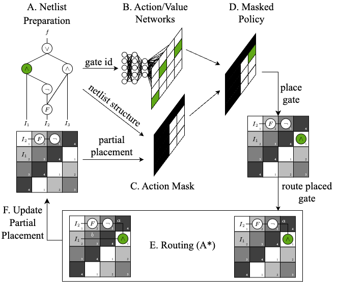

[](https://pypi.org/project/mnt.nanoplacer/)
[](https://opensource.org/licenses/MIT)
[](https://github.com/cda-tum/mnt-nanoplacer/actions/workflows/deploy.yml)
[![Code style: black][black-badge]][black-link]

# NanoPlaceR: Placement and Routing for Field-coupled Nanocomputing (FCN) based on Reinforcement Learning

<p align="center">
  <picture>
    <source media="(prefers-color-scheme: dark)" srcset="https://raw.githubusercontent.com/cda-tum/mnt-bench/main/img/mnt_light.svg" width="60%">
    
  </picture>
</p>

NanoPlaceR is a tool for the physical design of FCN circuitry based on Reinforcement Learning.
It can generate layouts for logic networks up to ~200 gates, while requiring ~50% less area than the state-of-the-art heuristic approach.

Related publication presented at DAC: [paper](https://www.cda.cit.tum.de/files/eda/2023_dac_late_breaking_results_from_hybrid_design_automation_for_field_coupled_nanotechnologies.pdf)

Inspired by recent developments in the field of machine learning-aided design automation, this tool combines reinforcement learning with efficient path routing algorithms based on established algorithms such as A\* search.
Masked Proximal Policy Optimization (PPO) is used to learn the placement of logic elements, which is further accelerated by incorporating an action mask computed based on the netlist structure and the last partial placement, ensuring valid and compact solutions.
To minimize the occurrence of unpromising partial placements, several checks constantly ensure the early termination of sub-par solutions.
Furthermore, the routing of placed gates is incorporated directly into the placement step using established routing strategies.
The following figure outlines the methodology:



# Usage of NanoPlaceR

Currently, due to the Open-AI gym dependency, only python versions up to 3.10 are supported.

If you do not have a virtual environment set up, the following steps outline one possible way to do so.
First, install virtualenv:

```console
$ pip install virtualenv
```

Then create a new virtual environment in your project folder and activate it:

```console
$ mkdir nano_placement
$ cd nano_placement
$ python -m venv venv
$ source venv/bin/activate
```

NanoPlaceR can be installed via pip:

```console
(venv) $ pip install mnt.nanoplacer
```

You can then create the desired layout based on specified parameters (e.g. logic function, clocking scheme, layout width etc.).

```
from mnt import nanoplacer

if __name__ == "__main__":
    clocking_scheme = "2DDWave"  # 2DDWave,USE, RES, ESR
    technology = "QCA"  # QCA, SiDB, Gate-level
    minimal_layout_dimension = True  # if True, experimentally found minimal layout dimensions, else user specified layout dimensions are chosen
    layout_width = 3
    layout_height = 4
    benchmark = "trindade16"  # fontes18, trindade16, EPFL, TOY, ISCAS85
    function = "mux21"
    time_steps = 10000  # number of time steps to train the RL agent.
    reset_model = True  # if True, reset saved model and train from scratch.
    verbose = 0  # 0: Only show number of placed gates
    #              1: print layout after every new best placement
    #              2: print training metrics
    #              3: print layout and training metrics
    optimize = True

    nanoplacer.create_layout(
        benchmark,
        function,
        clocking_scheme,
        technology,
        minimal_layout_dimension,
        layout_width,
        layout_height,
        time_steps,
        reset_model,
        verbose,
        optimize,
    )
```

# Repository Structure

```
.
├── benchmarks/                       # common benchmark sets
├── images/                           # generated layouts in .svg format are saved here
├── models/                           # ppo models
├── placement_envs/
│ ├── nano_placement_env/           # placement environment
│ ├── utils/
│   └── placement_utils/              # placement util functions
│   └── layout_dimenions/             # predefined layout dimensions for certain functions
├── tensorboard/                      # tensorboard log directory
```

# Monitoring Training

Training can be monitored using [Tensorboard](https://www.tensorflow.org/tensorboard).

Install it via

```console
(venv) $ pip install tensorboard
```

and run the following command from within the NanoPlaceR directory:

```console
(venv) $ cd NanoPlaceR
(venv) $ tensorboard --logdir="tensorboard/{Insert function name here}"
```

# References

In case you are using NanoPlaceR in your work, we would be thankful if you referred to it by citing the following publication:

```bibtex
@INPROCEEDINGS{hofmann2023nanoplacer,
  author        = {S. Hofmann and M. Walter and L. Servadei and R. Wille},
  title         = {{Late Breaking Results From Hybrid Design Automation for Field-coupled Nanotechnologies}},
  booktitle     = {{Design Automation Conference (DAC)}},
  year          = {2023},
}
```

[mit-badge]: https://img.shields.io/badge/license-MIT-blue.svg?style=flat-square
[black-badge]: https://img.shields.io/badge/code%20style-black-000000.svg
[black-link]: https://github.com/psf/black
